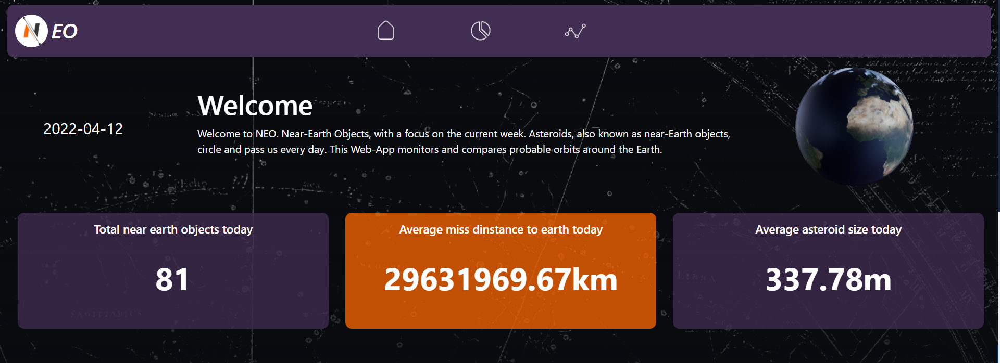
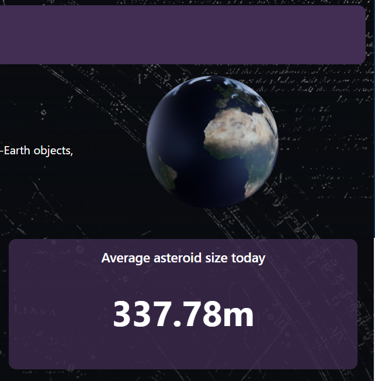
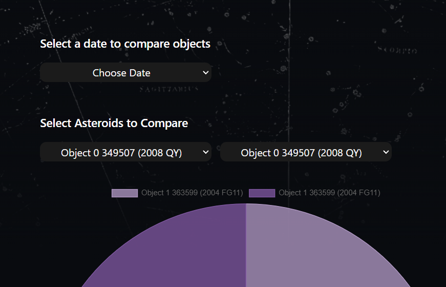
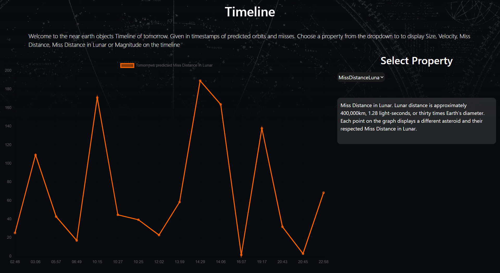
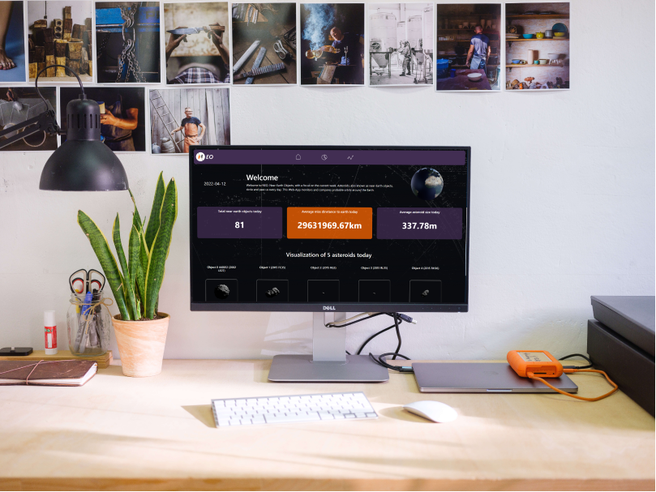
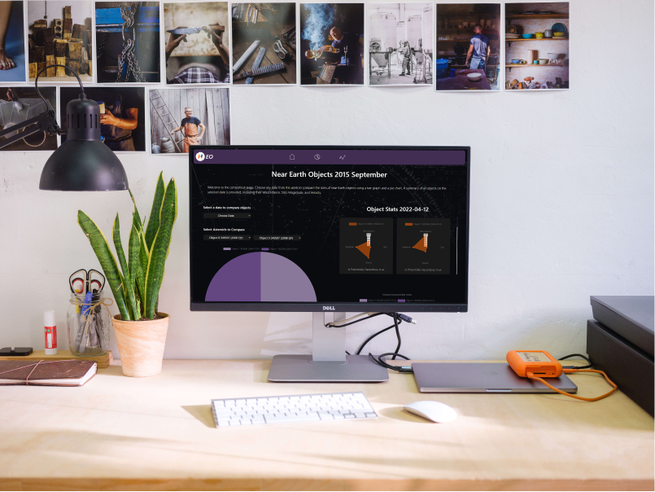

<!-- Repository Information & Links-->
<br />


<!-- HEADER SECTION -->
<h5 align="center" style="padding:0;margin:0;">Reinhardt de Beer</h5>
<h5 align="center" style="padding:0;margin:0;">21100115</h5>
<h6 align="center">DV200 - Term 1 | 2022</h6>
</br>
<p align="center">

  <a href="https://github.com/EpicBlue1/OOP_21100115_ReinhardtdeBeer">
    
  </a>
  
  <h3 align="center">NEO</h3>

  <p align="center">
    A web app made with react using a Nasa Near Earth Object Api to visualize data using charts js <br>

   <br />
   <br />    ·
    <a href="https://github.com/EpicBlue1/OOP_21100115_ReinhardtdeBeer/issues">Report Bug</a>
    ·
    <a href="https://github.com/EpicBlue1/OOP_21100115_ReinhardtdeBeer/issues">Request Feature</a>
</p>
<!-- TABLE OF CONTENTS -->

## Table of Contents

* [About the Project](#about-the-project)
  * [Project Description](#project-description)
  * [Built With](#built-with)
* [Getting Started](#getting-started)
  * [Prerequisites](#prerequisites)
  * [How to install](#how-to-install)
* [Features and Functionality](#features-and-functionality)
* [Concept Process](#concept-process)
   * [Ideation](#ideation)
   * [Wireframes](#wireframes)
   * [Custom UI](#user-flow)
* [Development Process](#development-process)
   * [Implementation Process](#implementation-process)
        * [Highlights](#highlights)
        * [Challenges](#challenges)
   * [Future Implementation](#peer-reviews)
* [Final Outcome](#final-outcome)
    * [Mockups](#mockups)
    * [Video Demonstration](#video-demonstration)
* [Conclusion](#conclusion)
* [License](#license)
* [Contact](#contact)
* [Acknowledgements](#acknowledgements)

<!--PROJECT DESCRIPTION-->
## About the Project
<!-- header image of project -->
![image1][image1]

### Project Description

Welcome to NEO. Near-Earth Objects, with a focus on the current week. Asteroids, also known as near-Earth objects, circle and pass us every day. This Web-App monitors and compares probable orbits around the Earth.

### Built With

* [React](https://reactjs.org/)
* [ChartJs](https://react-chartjs-2.netlify.app/)
* [Axios](https://www.npmjs.com/package/axios)
* [ReactRouterDom](https://reactrouter.com/)


<!-- GETTING STARTED -->
<!-- Make sure to add appropriate information about what prerequesite technologies the user would need and also the steps to install your project on their own mashines -->
## Getting Started

The following instructions will get you a copy of the project up and running on your local machine for development and testing purposes.

### Prerequisites

Ensure that you have the latest version of [NPM](https://www.npmjs.com/) installed on your machine. The [GitHub Desktop](https://desktop.github.com/) program will also be required.

### How to install

### Installation
Here are a couple of ways to clone this repo:

1. GitHub Desktop </br>
Enter `https://github.com/EpicBlue1/OOP_21100115_ReinhardtdeBeer.git` into the URL field and press the `Clone` button.

2. Clone Repository </br>
Run the following in the command-line to clone the project:
   ```sh
   git clone https://github.com/EpicBlue1/OOP_21100115_ReinhardtdeBeer.git
   ```
    Open `Software` and select `File | Open...` from the menu. Select cloned directory and press `Open` button

3. Install Dependencies </br>
Run the following in the command-line to install all the required dependencies:
   ```sh
   npm install
   ```

4. An API key is not required

<!-- FEATURES AND FUNCTIONALITY-->
<!-- You can add the links to all of your imagery at the bottom of the file as references -->
## Features and Functionality

<!-- note how you can use your gitHub link. Just make a path to your assets folder -->


### NASA Near Earth Objects 

Used a near earth objects dataset and utilizing todays predicted data and the coming week to visualize and compare asteroid using react components to built and charts js to visualize.


### Feature 2

An interactable 3D globe on the Dashboard


### Feature 3

Asteroid Previews representing their size


### Feature 4

Compare page. Select a upcomming date and compare predicted sizes


### Feature 5

Display in timestamps the predicted Miss Distance, Miss Distance in Lunar, Size, Velocity or Magnitude on a Timeline.




<!-- CONCEPT PROCESS -->
<!-- Briefly explain your concept ideation process -->
<!-- here you will add things like wireframing, data structure planning, anything that shows your process. You need to include images-->
## Concept Process

The `Conceptual Process` is the set of actions, activities and research that was done when starting this project.

### Ideation

[Pinterest Board For Concept](https://za.pinterest.com/debeer0072/development-year-2-term-1/) 
<br>

[Pinterest Board For Branded Component](https://za.pinterest.com/debeer0072/branded-component-dev-term-1/)  

### Wireframes


### Custom UI


<!-- DEVELOPMENT PROCESS -->
## Development Process

The `Development Process` is the technical implementations and functionality done in the frontend and backend of the application.

### Implementation Process
<!-- stipulate all of the functionality you included in the project -->
<!-- This is your time to shine, explain the technical nuances of your project, how did you achieve the final outcome!-->

* Utilized React `Charts.JS` dependency for Data visualization
* Utilized React `<Model-Viewer>` dependency for 3D interactable globe
* Utilized React `Sxios` dependency to make api calls
* Implemented Routing with `React-Router v6`.
* API End Point: https://api.nasa.gov/#browseAPI 

#### Highlights
<!-- stipulated the highlight you experienced with the project -->
* I learned a lot about react components, re-usable components, charts and most of all how to implement them.
* Getting a model I made in blender to display on my website was also highlight.
* At the end I am proud of the design I have created.
* Im happy with the functionality and logic I implemented and figuring it out was challenging but fun.

#### Challenges
<!-- stipulated the challenges you faced with the project and why you think you faced it or how you think you'll solve it (if not solved) -->
* Getting only 2 Radar charts to diaplay based on the two objects chosen to compare. I rather just displayed all teh objects on the chosen date. 
* Initially getting data to display on charts. I did not understand the map function you could use. So I created a separte let for each object. Luckily I figured out I could rather just make a for loop and a array, push that array, set that array and map certain vars within that array which spared a lot of time.
* I struggled with design. I asked around on the internet getting different opinions and feedback even non developers to improve upon my design. I went thropugh 3 iterations.
* I struggled with charts or whole pages not loading because of my chosen data set being slow. So I implemented dummy data for sets not including an object array. And a if statement checking if the data from a certain use state or prop is undefined or empty, and if it was to rather just return a div saying loading unitil its loaded.


#### Above And Beyond

<!-- what did you learn outside of the classroom and implement into your project-->
* 3D interactable models within websites.
* Although already familiar with blender and 3D modeling, I learned about what formats web model viewers use gltf and exporting these models properly with textures tothat they showcase on the website. Google model viewer is simpl, I can set speed, enviroment lighting and size.
<br>

* Design
* After intial feedback, I decided to grow out of my bias and expore website design. I asked for feedback on discord communities, reddit and looked at pinterest boards. I learned about the 60 30 10 color rule, how blocks can impact web flow and how there is a time and place for it.

### Future Implementation
<!-- stipulate functionality and improvements that can be implemented in the future. -->

* Only displaying two radars based on the objects you chose on the compare page.
* Create more re-usable components.
* Sort my components better.
* More contextualization.

<!-- MOCKUPS -->
## Final Outcome

### Mockups


<br>


<br>


<!-- VIDEO DEMONSTRATION -->
### Video Demonstration

To see a run through of the application, click below:

[View Demonstration](https://youtu.be/_ifrJrLPCv0)

<!-- AUTHORS -->
## Authors

* **Reinhardt de Beer** - [EpicBlue1](https://github.com/EpicBlue1)

<!-- LICENSE -->
## License

Distributed under the MIT License. See `LICENSE` for more information.\

<!-- LICENSE -->
## Contact

* **Reinhardt de Beer** - [21100115@virtualwindow.co.za](mailto:21100115@virtualwindow.co.za) - [@rdb_fotopatat](https://www.instagram.com/rdb_fotopatat/) 
* **Project Link** - https://github.com/EpicBlue1/OOP_21100115_ReinhardtdeBeer

<!-- ACKNOWLEDGEMENTS -->
## Acknowledgements
<!-- all resources that you used and Acknowledgements here -->
* [Nasa Api](https://api.nasa.gov/#browseAPI)
* [React](https://reactjs.org/)
* [ChartJs](https://react-chartjs-2.netlify.app/)
* [Model Viewer](https://modelviewer.dev/docs/)
* [React Bootstrap](https://react-bootstrap.github.io/)


